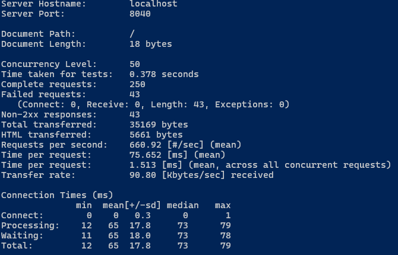
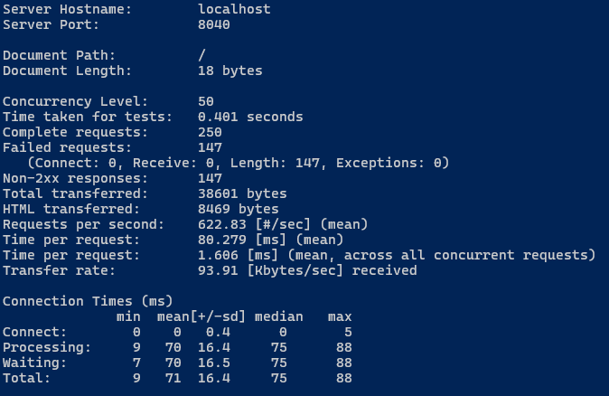
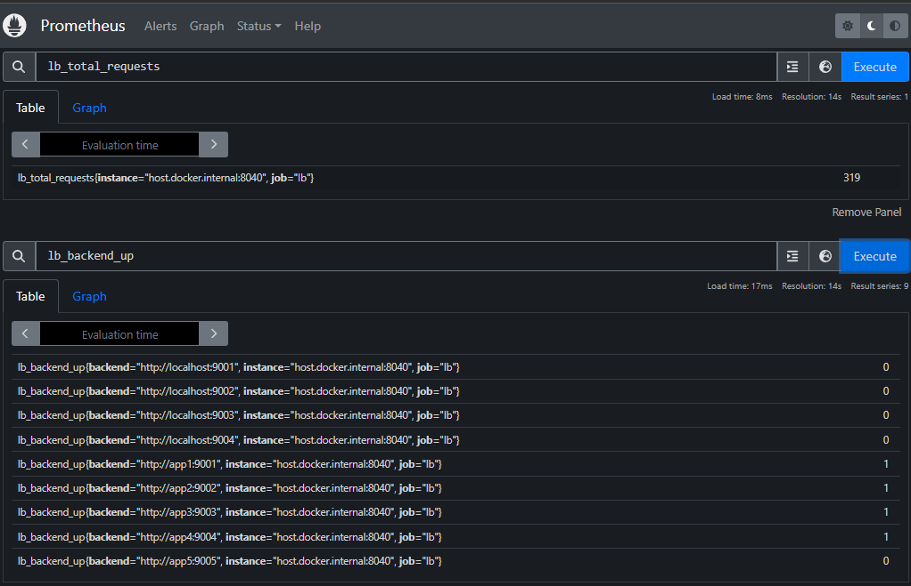
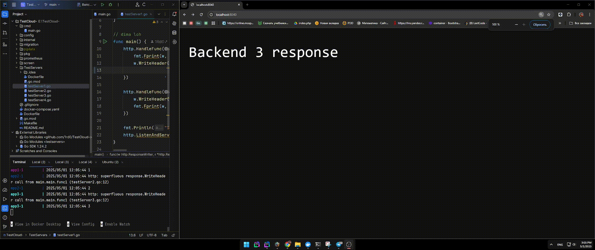

# TestCloud - Балансировщик нагрузки с Rate Limiting

---

## Оглавление

- [Описание](#описание)
- [Установка и запуск](#установка-и-запуск)
- [Структура проекта](#структура-проекта)
- [Конфигурация](#конфигурация)
- [Метрики](#метрики)
- [Prometheus](#prometheus)
- [Результат](#результат)


---

##  Описание

Проект реализует:

- HTTP балансировщик нагрузки с алгоритмом **Round Robin**
- Проверку состояния (health-check) бекендов
- **Rate limiting** по IP или API-ключу на основе Token Bucket
- Конфигурацию через YAML
- Интеграцию с **Prometheus**
- Подключение к базе данных Postgres для хранения лимитов
- Docker-развёртывание и миграции

---

##  Установка и запуск

```bash
git clone https://github.com/yourname/TestCloud.git
cd TestCloud
make upDocker       # запуск всех контейнеров
make migrate_up     # применение миграций
```
http://localhost:8040 — балансировщик
http://localhost:9090 — Prometheus
PostgreSQL — localhost:5430

##  Структура проекта


```bash

bash
internal/
  service/
    backend/    # Реализация backend и reverse proxy
    balancer/   # Round-robin логика
    limiter/    # Token Bucket + Middleware
    proxy/      # Входная точка + маршрутизация
    health/     # Проверка доступности backend'ов
  config/       # Загрузка конфигурации
  server/       # HTTP сервер + инициализация
pkg/
  gp/           # Работа с БД (pgx pool)
  logger/          # Конфигурация zap-логгера
  metrics/      # Prometheus метрики
```


## Конфигурация
```bash
isten: ":8040"
lb:
  Alg:
  backends:
    - localhost:9002
    - localhost:9001
    - localhost:9004
    - localhost:9003
    - app1:9001
    - app2:9002
    - app3:9003
    - app4:9004
    - app5:9005
rate:
  capacity: 100
  rps: 10
health:
  interval: 5s
  timeout:  2s

db:
  host: "postgres"
  port: 5432
  user: "user"
  pass: "secret"
  name: "postgres_db "
  min_conns: 5
  max_conns: 20
```
## Метрики
Тестирование с API-ключом:
```bash
ab -n 250 -c 50 -H "X-API-Key: me" http://localhost:8040/
```

Complete requests: 250

Failed requests: 43


```bash
ab -n 250 -c 50 http://localhost:8040/
```
-Complete requests:250

-Failed requests:147



## Prometheus



## Результат

